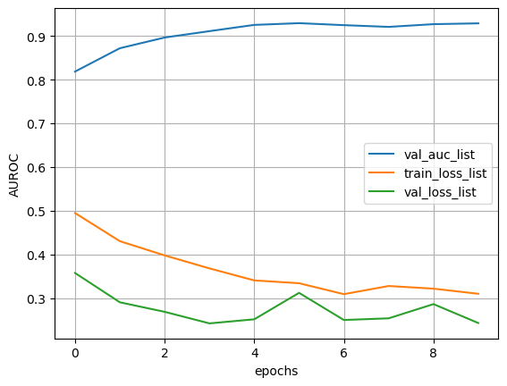

```python
import matplotlib.pyplot as plt
import numpy as np
from PIL import Image
import io
import cv2
import pandas as pd
import h5py
import torch
from torch.utils.data import Dataset
import torch.nn as nn
from sklearn.metrics import roc_auc_score
```

### 图像部分的baseline


```python
work_dir = '/Users/zhouyangfan/Desktop/kaggle/isic/isic-2024-challenge/'
train_hdf5 = work_dir + 'train-image.hdf5'
test_hdf5 = work_dir + 'test-image.hdf5'
train_csv_path = work_dir + 'train-metadata.csv'
test_csv_path = work_dir + 'test-metadata.csv'
```


```python
# csv文件读入
train_csv = pd.read_csv(train_csv_path)
train_csv
test_csv = pd.read_csv(test_csv_path)
test_csv
```

    /var/folders/d9/92g8nvjn0hzc8n9khs6d2k_r0000gn/T/ipykernel_84415/2022361352.py:2: DtypeWarning: Columns (51,52) have mixed types. Specify dtype option on import or set low_memory=False.
      train_csv = pd.read_csv(train_csv_path)


<div>
<style scoped>
    .dataframe tbody tr th:only-of-type {
        vertical-align: middle;
    }

    .dataframe tbody tr th {
        vertical-align: top;
    }

    .dataframe thead th {
        text-align: right;
    }
</style>
<table border="1" class="dataframe">
  <thead>
    <tr style="text-align: right;">
      <th></th>
      <th>isic_id</th>
      <th>patient_id</th>
      <th>age_approx</th>
      <th>sex</th>
      <th>anatom_site_general</th>
      <th>clin_size_long_diam_mm</th>
      <th>image_type</th>
      <th>tbp_tile_type</th>
      <th>tbp_lv_A</th>
      <th>tbp_lv_Aext</th>
      <th>...</th>
      <th>tbp_lv_radial_color_std_max</th>
      <th>tbp_lv_stdL</th>
      <th>tbp_lv_stdLExt</th>
      <th>tbp_lv_symm_2axis</th>
      <th>tbp_lv_symm_2axis_angle</th>
      <th>tbp_lv_x</th>
      <th>tbp_lv_y</th>
      <th>tbp_lv_z</th>
      <th>attribution</th>
      <th>copyright_license</th>
    </tr>
  </thead>
  <tbody>
    <tr>
      <th>0</th>
      <td>ISIC_0015657</td>
      <td>IP_6074337</td>
      <td>45.0</td>
      <td>male</td>
      <td>posterior torso</td>
      <td>2.70</td>
      <td>TBP tile: close-up</td>
      <td>3D: XP</td>
      <td>22.80433</td>
      <td>20.007270</td>
      <td>...</td>
      <td>0.304827</td>
      <td>1.281532</td>
      <td>31.114600</td>
      <td>0.479339</td>
      <td>20</td>
      <td>-155.06510</td>
      <td>1511.222000</td>
      <td>113.980100</td>
      <td>Memorial Sloan Kettering Cancer Center</td>
      <td>CC-BY</td>
    </tr>
    <tr>
      <th>1</th>
      <td>ISIC_0015729</td>
      <td>IP_1664139</td>
      <td>35.0</td>
      <td>female</td>
      <td>lower extremity</td>
      <td>2.52</td>
      <td>TBP tile: close-up</td>
      <td>3D: XP</td>
      <td>16.64867</td>
      <td>9.657964</td>
      <td>...</td>
      <td>0.000000</td>
      <td>1.271940</td>
      <td>68.141071</td>
      <td>0.426230</td>
      <td>25</td>
      <td>-112.36924</td>
      <td>629.535889</td>
      <td>-15.019287</td>
      <td>Frazer Institute, The University of Queensland...</td>
      <td>CC-BY</td>
    </tr>
    <tr>
      <th>2</th>
      <td>ISIC_0015740</td>
      <td>IP_7142616</td>
      <td>65.0</td>
      <td>male</td>
      <td>posterior torso</td>
      <td>3.16</td>
      <td>TBP tile: close-up</td>
      <td>3D: XP</td>
      <td>24.25384</td>
      <td>19.937380</td>
      <td>...</td>
      <td>0.230742</td>
      <td>1.080308</td>
      <td>41.358640</td>
      <td>0.366071</td>
      <td>110</td>
      <td>-84.29282</td>
      <td>1303.978000</td>
      <td>-28.576050</td>
      <td>FNQH Cairns</td>
      <td>CC-BY</td>
    </tr>
  </tbody>
</table>
<p>3 rows × 44 columns</p>
</div>


```python
def get_train_file_path(image_id):
    return f"{work_dir}train-image/image/{image_id}.jpg"
```


```python
# # hdf5文件读入
# train_dataset = h5py.File(train_hdf5, 'r')
# train_images = {}
# for image in train_dataset.keys():
#     train_image = train_dataset[image]
#     img_plt = Image.open(io.BytesIO(np.array(train_image)))
#     img_array = np.array(img_plt)
#     train_images[image] = img_array
# test_dataset = h5py.File(test_hdf5, 'r')
# test_images = {}
# for image in test_dataset.keys():
#     test_image = test_dataset[image]
#     img_plt = Image.open(io.BytesIO(np.array(test_image)))
#     img_array = np.array(img_plt)
#     test_images[image] = img_array
```


```python
# 样本均衡
train_csv_positive = train_csv[train_csv.target == 1]
train_csv_negative = train_csv[train_csv.target == 0].sample(frac=1.0)
# 正负样本比 1:5
train_csv_balanced = pd.concat([train_csv_positive, train_csv_negative.iloc[:train_csv_positive.shape[0] * 5, :]]).sample(frac=1.0).reset_index(drop=True)

```


```python
train_csv_negative.shape
```


    (400666, 55)


```python
train_csv_balanced.shape
```


    (2358, 57)


```python
train_csv_balanced
```


<div>
<style scoped>
    .dataframe tbody tr th:only-of-type {
        vertical-align: middle;
    }

    .dataframe tbody tr th {
        vertical-align: top;
    }

    .dataframe thead th {
        text-align: right;
    }
</style>
<table border="1" class="dataframe">
  <thead>
    <tr style="text-align: right;">
      <th></th>
      <th>isic_id</th>
      <th>target</th>
      <th>patient_id</th>
      <th>age_approx</th>
      <th>sex</th>
      <th>anatom_site_general</th>
      <th>clin_size_long_diam_mm</th>
      <th>image_type</th>
      <th>tbp_tile_type</th>
      <th>tbp_lv_A</th>
      <th>...</th>
      <th>lesion_id</th>
      <th>iddx_full</th>
      <th>iddx_1</th>
      <th>iddx_2</th>
      <th>iddx_3</th>
      <th>iddx_4</th>
      <th>iddx_5</th>
      <th>mel_mitotic_index</th>
      <th>mel_thick_mm</th>
      <th>tbp_lv_dnn_lesion_confidence</th>
    </tr>
  </thead>
  <tbody>
    <tr>
      <th>0</th>
      <td>ISIC_4717315</td>
      <td>0</td>
      <td>IP_7205082</td>
      <td>65.0</td>
      <td>female</td>
      <td>posterior torso</td>
      <td>4.66</td>
      <td>TBP tile: close-up</td>
      <td>3D: white</td>
      <td>16.459490</td>
      <td>...</td>
      <td>NaN</td>
      <td>Benign</td>
      <td>Benign</td>
      <td>NaN</td>
      <td>NaN</td>
      <td>NaN</td>
      <td>NaN</td>
      <td>NaN</td>
      <td>NaN</td>
      <td>99.981490</td>
    </tr>
    <tr>
      <th>1</th>
      <td>ISIC_1996222</td>
      <td>0</td>
      <td>IP_7105810</td>
      <td>60.0</td>
      <td>female</td>
      <td>lower extremity</td>
      <td>2.65</td>
      <td>TBP tile: close-up</td>
      <td>3D: white</td>
      <td>20.242340</td>
      <td>...</td>
      <td>IL_3135248</td>
      <td>Benign</td>
      <td>Benign</td>
      <td>NaN</td>
      <td>NaN</td>
      <td>NaN</td>
      <td>NaN</td>
      <td>NaN</td>
      <td>NaN</td>
      <td>100.000000</td>
    </tr>
    <tr>
      <th>2</th>
      <td>ISIC_6245467</td>
      <td>0</td>
      <td>IP_8945836</td>
      <td>50.0</td>
      <td>male</td>
      <td>anterior torso</td>
      <td>3.01</td>
      <td>TBP tile: close-up</td>
      <td>3D: XP</td>
      <td>20.493160</td>
      <td>...</td>
      <td>NaN</td>
      <td>Benign</td>
      <td>Benign</td>
      <td>NaN</td>
      <td>NaN</td>
      <td>NaN</td>
      <td>NaN</td>
      <td>NaN</td>
      <td>NaN</td>
      <td>99.855860</td>
    </tr>
    <tr>
      <th>3</th>
      <td>ISIC_2720547</td>
      <td>0</td>
      <td>IP_6724798</td>
      <td>60.0</td>
      <td>male</td>
      <td>anterior torso</td>
      <td>4.26</td>
      <td>TBP tile: close-up</td>
      <td>3D: XP</td>
      <td>23.877950</td>
      <td>...</td>
      <td>NaN</td>
      <td>Benign</td>
      <td>Benign</td>
      <td>NaN</td>
      <td>NaN</td>
      <td>NaN</td>
      <td>NaN</td>
      <td>NaN</td>
      <td>NaN</td>
      <td>100.000000</td>
    </tr>
    <tr>
      <th>4</th>
      <td>ISIC_8569576</td>
      <td>1</td>
      <td>IP_3537591</td>
      <td>45.0</td>
      <td>male</td>
      <td>head/neck</td>
      <td>1.39</td>
      <td>TBP tile: close-up</td>
      <td>3D: white</td>
      <td>29.987196</td>
      <td>...</td>
      <td>IL_8910080</td>
      <td>Malignant::Malignant adnexal epithelial prolif...</td>
      <td>Malignant</td>
      <td>Malignant adnexal epithelial proliferations - ...</td>
      <td>Basal cell carcinoma</td>
      <td>Basal cell carcinoma, Superficial</td>
      <td>NaN</td>
      <td>NaN</td>
      <td>NaN</td>
      <td>44.662490</td>
    </tr>
    <tr>
      <th>...</th>
      <td>...</td>
      <td>...</td>
      <td>...</td>
      <td>...</td>
      <td>...</td>
      <td>...</td>
      <td>...</td>
      <td>...</td>
      <td>...</td>
      <td>...</td>
      <td>...</td>
      <td>...</td>
      <td>...</td>
      <td>...</td>
      <td>...</td>
      <td>...</td>
      <td>...</td>
      <td>...</td>
      <td>...</td>
      <td>...</td>
      <td>...</td>
    </tr>
    <tr>
      <th>2353</th>
      <td>ISIC_7545504</td>
      <td>0</td>
      <td>IP_3144881</td>
      <td>60.0</td>
      <td>female</td>
      <td>posterior torso</td>
      <td>2.33</td>
      <td>TBP tile: close-up</td>
      <td>3D: XP</td>
      <td>20.633371</td>
      <td>...</td>
      <td>IL_1838649</td>
      <td>Benign</td>
      <td>Benign</td>
      <td>NaN</td>
      <td>NaN</td>
      <td>NaN</td>
      <td>NaN</td>
      <td>NaN</td>
      <td>NaN</td>
      <td>100.000000</td>
    </tr>
    <tr>
      <th>2354</th>
      <td>ISIC_2478729</td>
      <td>0</td>
      <td>IP_7299252</td>
      <td>45.0</td>
      <td>female</td>
      <td>posterior torso</td>
      <td>3.69</td>
      <td>TBP tile: close-up</td>
      <td>3D: XP</td>
      <td>21.484870</td>
      <td>...</td>
      <td>NaN</td>
      <td>Benign</td>
      <td>Benign</td>
      <td>NaN</td>
      <td>NaN</td>
      <td>NaN</td>
      <td>NaN</td>
      <td>NaN</td>
      <td>NaN</td>
      <td>99.999950</td>
    </tr>
    <tr>
      <th>2355</th>
      <td>ISIC_4531465</td>
      <td>0</td>
      <td>IP_4414342</td>
      <td>40.0</td>
      <td>female</td>
      <td>upper extremity</td>
      <td>3.10</td>
      <td>TBP tile: close-up</td>
      <td>3D: XP</td>
      <td>26.321774</td>
      <td>...</td>
      <td>NaN</td>
      <td>Benign</td>
      <td>Benign</td>
      <td>NaN</td>
      <td>NaN</td>
      <td>NaN</td>
      <td>NaN</td>
      <td>NaN</td>
      <td>NaN</td>
      <td>100.000000</td>
    </tr>
    <tr>
      <th>2356</th>
      <td>ISIC_1705108</td>
      <td>1</td>
      <td>IP_4304202</td>
      <td>55.0</td>
      <td>male</td>
      <td>anterior torso</td>
      <td>2.02</td>
      <td>TBP tile: close-up</td>
      <td>3D: white</td>
      <td>19.413089</td>
      <td>...</td>
      <td>IL_7008082</td>
      <td>Malignant::Malignant adnexal epithelial prolif...</td>
      <td>Malignant</td>
      <td>Malignant adnexal epithelial proliferations - ...</td>
      <td>Basal cell carcinoma</td>
      <td>Basal cell carcinoma, Nodular</td>
      <td>NaN</td>
      <td>NaN</td>
      <td>NaN</td>
      <td>36.337227</td>
    </tr>
    <tr>
      <th>2357</th>
      <td>ISIC_8526630</td>
      <td>0</td>
      <td>IP_6863831</td>
      <td>60.0</td>
      <td>male</td>
      <td>posterior torso</td>
      <td>2.60</td>
      <td>TBP tile: close-up</td>
      <td>3D: XP</td>
      <td>25.846710</td>
      <td>...</td>
      <td>NaN</td>
      <td>Benign</td>
      <td>Benign</td>
      <td>NaN</td>
      <td>NaN</td>
      <td>NaN</td>
      <td>NaN</td>
      <td>NaN</td>
      <td>NaN</td>
      <td>99.994800</td>
    </tr>
  </tbody>
</table>
<p>2358 rows × 55 columns</p>
</div>


```python
# train_csv_balanced
train_csv_balanced["file_path"] = train_csv_balanced["isic_id"].apply(get_train_file_path)
```


```python
# 训练集和验证集划分
train_csv_balanced["fold"] = np.random.randint(1, 6, size = train_csv_balanced.shape[0])
valid_csv_fold = train_csv_balanced[train_csv_balanced.fold == 5]
train_csv_fold = train_csv_balanced[train_csv_balanced.fold != 5]
```


```python
train_csv_fold.shape
```


    (1873, 57)


```python
# 不加 transform
class MelanomaDataset(Dataset):
    def __init__(self, csv,  mode, transform=None):
        self.csv = csv.reset_index(drop=True)
        self.mode = mode
        self.transform = transform

    def __len__(self):
        return self.csv.shape[0]

    def __getitem__(self, index):

        row = self.csv.iloc[index]
        #image = self.img_dict[row.isic_id]
        image = cv2.imread(row.file_path)
        image = cv2.resize(image, (200, 200))
        image = cv2.cvtColor(image, cv2.COLOR_BGR2RGB)

        if self.transform is not None:
            res = self.transform(image=image)
            image = res['image'].astype(np.float32)
        else:
            image = image.astype(np.float32)

        image = image.transpose(2, 0, 1)
        
        data = torch.tensor(image).float()

        if self.mode == 'test':
            return data
        else:
            return data, torch.tensor(self.csv.iloc[index].target).long()
```


```python
class CNN(nn.Module):
    def __init__(self, output_size, no_columns):
        super().__init__()
        self.no_columns, self.output_size = no_columns, output_size
        
        # Define Feature part (IMAGE)
        self.features = nn.Sequential(
            nn.Conv2d(self.no_columns, 64, kernel_size=11, stride=4, padding=2),
            nn.ReLU(inplace=True),
            nn.MaxPool2d(kernel_size=3, stride=2),
            nn.Conv2d(64, 192, kernel_size=5, padding=2),
            nn.ReLU(inplace=True),
            nn.MaxPool2d(kernel_size=3, stride=2),
            nn.Conv2d(192, 384, kernel_size=3, padding=1),
            nn.ReLU(inplace=True),
            nn.Conv2d(384, 256, kernel_size=3, padding=1),
            nn.ReLU(inplace=True),
            nn.Conv2d(256, 256, kernel_size=3, padding=1),
            nn.ReLU(inplace=True),
            nn.MaxPool2d(kernel_size=3, stride=2),
        )
        self.avgpool = nn.AdaptiveAvgPool2d((5, 5))
        
        # Define Classification part
        self.classification = nn.Sequential(
            nn.Dropout(),
            nn.Linear(256 * 5 * 5, 4096),
            nn.ReLU(inplace=True),
            nn.Dropout(),
            nn.Linear(4096, 4096),
            nn.ReLU(inplace=True),
            nn.Linear(4096, self.output_size),
        )
        self.sigmoid = nn.Sigmoid()

    def forward(self, image, prints=False):
        
        if prints: print('Input Image shape:', image.shape, '\n')
                         # +
                         # 'Input csv_data shape:', csv_data.shape)
        
        # Image CNN
        image = self.features(image)
        #print("After conv2:", image.size())
        image = self.avgpool(image)
        image = torch.flatten(image, 1)
        
        if prints: print('Features Image shape:', image.shape)
        
        out = self.classification(image)
        if prints: print('Out shape:', out.shape)
        
        return out
```


```python
criterion = nn.CrossEntropyLoss()
def train_epoch(model, loader, optimizer):

    model.train()
    train_loss = []
    bar = tqdm(loader)
    for (data, target) in bar:
        optimizer.zero_grad()
       
        data, target = data.to(device), target.to(device)
        logits = model(data)    

        # print(logits)
        # print(target)
        
        loss = criterion(logits, target)

        loss.backward()
        
        optimizer.step()

        loss_np = loss.detach().cpu().numpy()
        train_loss.append(loss_np)
        smooth_loss = sum(train_loss[-100:]) / min(len(train_loss), 100)
        bar.set_description('loss: %.5f, smth: %.5f' % (loss_np, smooth_loss))


        # param_grad_list = []
        # for param in model.parameters():
        #     param_grad_list.append(param.grad.abs().sum())
        # print(param_grad_list)

    train_loss = np.mean(train_loss)
    return train_loss
    
def val_epoch(model, loader, n_test=1):

    model.eval()
    val_loss = []
    LOGITS = []
    PROBS = []
    TARGETS = []
    
    with torch.no_grad():
        for (data, target) in tqdm(loader):
            
            data, target = data.to(device), target.to(device)
            
            logits = model(data)
            loss = criterion(logits, target)
            probs = logits.softmax(1)

            val_loss.append(loss.detach().cpu().numpy())
            LOGITS.append(logits.detach().cpu())
            PROBS.append(probs.detach().cpu())
            TARGETS.append(target.detach().cpu())
            
   
    # 当前epoch的最后100次损失
    smooth_loss = sum(val_loss[-100:]) / min(len(val_loss), 100)
    bar.set_description('loss: %.5f, smth: %.5f' % (loss, smooth_loss))
    # 当前epoch的的损失
    val_loss = np.mean(val_loss)

    # 计算auc和准确率
    LOGITS = torch.cat(LOGITS).numpy()
    PROBS = torch.cat(PROBS).numpy()
    TARGETS = torch.cat(TARGETS).numpy()

    val_auc = roc_auc_score((TARGETS == 1).astype(float), PROBS[:, 1])    
    return val_loss, val_auc
```


```python
torch.cat([logits.softmax(1),logits.softmax(1)])
```


    tensor([[0.8176, 0.1824],
            [0.1824, 0.8176],
            [0.8176, 0.1824],
            [0.1824, 0.8176]])


```python
target
```


    tensor([0, 1])


```python
valid_csv_fold.shape
```


    (485, 57)


```python

```


    CNN(
      (features): Sequential(
        (0): Conv2d(3, 64, kernel_size=(11, 11), stride=(4, 4), padding=(2, 2))
        (1): ReLU(inplace=True)
        (2): MaxPool2d(kernel_size=3, stride=2, padding=0, dilation=1, ceil_mode=False)
        (3): Conv2d(64, 192, kernel_size=(5, 5), stride=(1, 1), padding=(2, 2))
        (4): ReLU(inplace=True)
        (5): MaxPool2d(kernel_size=3, stride=2, padding=0, dilation=1, ceil_mode=False)
        (6): Conv2d(192, 384, kernel_size=(3, 3), stride=(1, 1), padding=(1, 1))
        (7): ReLU(inplace=True)
        (8): Conv2d(384, 256, kernel_size=(3, 3), stride=(1, 1), padding=(1, 1))
        (9): ReLU(inplace=True)
        (10): Conv2d(256, 256, kernel_size=(3, 3), stride=(1, 1), padding=(1, 1))
        (11): ReLU(inplace=True)
        (12): MaxPool2d(kernel_size=3, stride=2, padding=0, dilation=1, ceil_mode=False)
      )
      (avgpool): AdaptiveAvgPool2d(output_size=(5, 5))
      (classification): Sequential(
        (0): Dropout(p=0.5, inplace=False)
        (1): Linear(in_features=6400, out_features=4096, bias=True)
        (2): ReLU(inplace=True)
        (3): Dropout(p=0.5, inplace=False)
        (4): Linear(in_features=4096, out_features=4096, bias=True)
        (5): ReLU(inplace=True)
        (6): Linear(in_features=4096, out_features=2, bias=True)
      )
      (sigmoid): Sigmoid()
    )


```python
# a = torch.tensor([[[1,2,3],[2,3,4]],[[0,0,0],[0,0,0]]])
# a.sum(axis = 2)
```


```python
#train_loss = train_epoch(model, train_loader, optimizer)
```


```python
#valid_loss = val_epoch(model, valid_loader, optimizer)
```


```python
traindf = MelanomaDataset(train_csv_fold, "train")
validdf = MelanomaDataset(valid_csv_fold, "train")
train_loader = torch.utils.data.DataLoader(traindf, batch_size=32)
valid_loader = torch.utils.data.DataLoader(validdf, batch_size=32)

model = CNN(output_size=2, no_columns=3)
optimizer = optim.Adam(model.parameters(), lr=0.0001)

device = torch.device("mps")
model.to(device)

# 开始训练
train_loss_list = []
val_loss_list = []
val_auc_list = []

auc_max = 0.
model_file = work_dir + 'auc_best_model.pth'
for epoch in range(1, 11):
    train_loss = train_epoch(model, train_loader, optimizer)
    val_loss, auc = val_epoch(model, valid_loader)
    train_loss_list.append(train_loss)
    val_loss_list.append(val_loss)
    val_auc_list.append(auc)

    if auc > auc_max:
        print('auc_max ({:.6f} --> {:.6f}). Saving model ...'.format(auc_max, auc))
        torch.save(model.state_dict(), model_file)
        auc_max = auc
```

    loss: 0.22421, smth: 0.49515: 100%|█████████████| 59/59 [00:07<00:00,  8.29it/s]
    100%|███████████████████████████████████████████| 16/16 [00:00<00:00, 19.95it/s]


    auc_max (0.000000 --> 0.818500). Saving model ...


    loss: 0.11465, smth: 0.43083: 100%|█████████████| 59/59 [00:06<00:00,  8.54it/s]
    100%|███████████████████████████████████████████| 16/16 [00:00<00:00, 19.89it/s]


    auc_max (0.818500 --> 0.871849). Saving model ...


    loss: 0.15779, smth: 0.39835: 100%|█████████████| 59/59 [00:06<00:00,  9.17it/s]
    100%|███████████████████████████████████████████| 16/16 [00:00<00:00, 24.93it/s]


    auc_max (0.871849 --> 0.896295). Saving model ...


    loss: 0.13462, smth: 0.36863: 100%|█████████████| 59/59 [00:06<00:00,  9.36it/s]
    100%|███████████████████████████████████████████| 16/16 [00:00<00:00, 24.66it/s]


    auc_max (0.896295 --> 0.910873). Saving model ...


    loss: 0.15754, smth: 0.34119: 100%|█████████████| 59/59 [00:06<00:00,  8.55it/s]
    100%|███████████████████████████████████████████| 16/16 [00:00<00:00, 24.52it/s]


    auc_max (0.910873 --> 0.925134). Saving model ...


    loss: 0.15805, smth: 0.33473: 100%|█████████████| 59/59 [00:06<00:00,  9.26it/s]
    100%|███████████████████████████████████████████| 16/16 [00:00<00:00, 24.36it/s]


    auc_max (0.925134 --> 0.929113). Saving model ...


    loss: 0.11771, smth: 0.30977: 100%|█████████████| 59/59 [00:06<00:00,  8.91it/s]
    100%|███████████████████████████████████████████| 16/16 [00:00<00:00, 22.25it/s]
    loss: 0.13756, smth: 0.32840: 100%|█████████████| 59/59 [00:06<00:00,  9.08it/s]
    100%|███████████████████████████████████████████| 16/16 [00:00<00:00, 19.49it/s]
    loss: 0.14288, smth: 0.32232: 100%|█████████████| 59/59 [00:07<00:00,  7.80it/s]
    100%|███████████████████████████████████████████| 16/16 [00:00<00:00, 23.03it/s]
    loss: 0.11977, smth: 0.31064: 100%|█████████████| 59/59 [00:07<00:00,  8.28it/s]
    100%|███████████████████████████████████████████| 16/16 [00:00<00:00, 24.44it/s]


```python
train_loss_list
```


```python
val_loss_list
```


    [0.41337806, 0.3771079, 0.30923563, 0.2786735, 0.24491966]


```python
val_auc_list
```


    [0.704004329004329,
     0.8435510567863509,
     0.8852813852813852,
     0.9006557168321875,
     0.9209001782531194]


```python
plt.plot(range(len(val_auc_list)), val_auc_list, label="val_auc_list")
plt.plot(range(len(train_loss_list)), train_loss_list, label="train_loss_list")
plt.plot(range(len(val_loss_list)), val_loss_list, label="val_loss_list")
#plt.plot( range(history.shape[0]), history["Valid AUROC"].values, label="Valid AUROC")
plt.xlabel("epochs")
plt.ylabel("AUROC")
plt.grid()
plt.legend()
plt.show()
```


    

    


```python
stack = {}
if stack:
    print("yes")
    print(stack)
if not stack:
    print("no")
    print(stack.add("1"))
    print(stack)
```

    no


    ---------------------------------------------------------------------------

    AttributeError                            Traceback (most recent call last)

    Cell In[447], line 7
          5 if not stack:
          6     print("no")
    ----> 7     print(stack.add("1"))
          8     print(stack)


    AttributeError: 'dict' object has no attribute 'add'


```python

```
