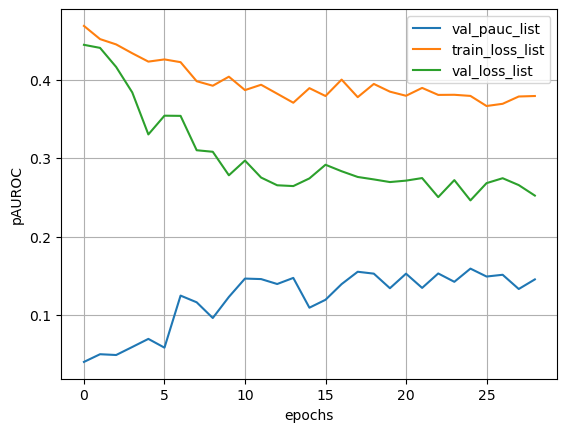
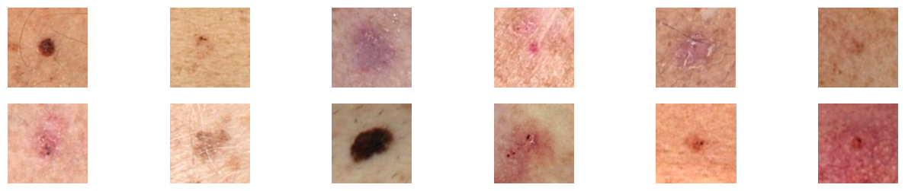

```python
import matplotlib.pyplot as plt
import numpy as np
from tqdm import tqdm
from PIL import Image
import io
import cv2
import pandas as pd
import h5py
import torch
from torch.utils.data import Dataset
import torch.nn as nn
from sklearn.metrics import roc_auc_score
from resnest.torch import resnest101
import torch.optim as optim
import random
from sklearn.metrics import roc_curve, auc
```

### 图像部分的baseline


```python
work_dir = '/Users/zhouyangfan/Desktop/kaggle/isic/isic-2024-challenge/'
train_hdf5_path = work_dir + 'train-image.hdf5'
train_csv_path = work_dir + 'train-metadata.csv'
```


```python
device = torch.device("cuda" if torch.cuda.is_available() else "mps")
```


```python
# csv文件读入
train_csv = pd.read_csv(train_csv_path)
train_csv
```

    /var/folders/d9/92g8nvjn0hzc8n9khs6d2k_r0000gn/T/ipykernel_79840/2617942849.py:2: DtypeWarning: Columns (51,52) have mixed types. Specify dtype option on import or set low_memory=False.
      train_csv = pd.read_csv(train_csv_path)


<div>
<style scoped>
    .dataframe tbody tr th:only-of-type {
        vertical-align: middle;
    }

    .dataframe tbody tr th {
        vertical-align: top;
    }

    .dataframe thead th {
        text-align: right;
    }
</style>
<table border="1" class="dataframe">
  <thead>
    <tr style="text-align: right;">
      <th></th>
      <th>isic_id</th>
      <th>target</th>
      <th>patient_id</th>
      <th>age_approx</th>
      <th>sex</th>
      <th>anatom_site_general</th>
      <th>clin_size_long_diam_mm</th>
      <th>image_type</th>
      <th>tbp_tile_type</th>
      <th>tbp_lv_A</th>
      <th>...</th>
      <th>lesion_id</th>
      <th>iddx_full</th>
      <th>iddx_1</th>
      <th>iddx_2</th>
      <th>iddx_3</th>
      <th>iddx_4</th>
      <th>iddx_5</th>
      <th>mel_mitotic_index</th>
      <th>mel_thick_mm</th>
      <th>tbp_lv_dnn_lesion_confidence</th>
    </tr>
  </thead>
  <tbody>
    <tr>
      <th>0</th>
      <td>ISIC_0015670</td>
      <td>0</td>
      <td>IP_1235828</td>
      <td>60.0</td>
      <td>male</td>
      <td>lower extremity</td>
      <td>3.04</td>
      <td>TBP tile: close-up</td>
      <td>3D: white</td>
      <td>20.244422</td>
      <td>...</td>
      <td>NaN</td>
      <td>Benign</td>
      <td>Benign</td>
      <td>NaN</td>
      <td>NaN</td>
      <td>NaN</td>
      <td>NaN</td>
      <td>NaN</td>
      <td>NaN</td>
      <td>97.517282</td>
    </tr>
    <tr>
      <th>1</th>
      <td>ISIC_0015845</td>
      <td>0</td>
      <td>IP_8170065</td>
      <td>60.0</td>
      <td>male</td>
      <td>head/neck</td>
      <td>1.10</td>
      <td>TBP tile: close-up</td>
      <td>3D: white</td>
      <td>31.712570</td>
      <td>...</td>
      <td>IL_6727506</td>
      <td>Benign</td>
      <td>Benign</td>
      <td>NaN</td>
      <td>NaN</td>
      <td>NaN</td>
      <td>NaN</td>
      <td>NaN</td>
      <td>NaN</td>
      <td>3.141455</td>
    </tr>
    <tr>
      <th>2</th>
      <td>ISIC_0015864</td>
      <td>0</td>
      <td>IP_6724798</td>
      <td>60.0</td>
      <td>male</td>
      <td>posterior torso</td>
      <td>3.40</td>
      <td>TBP tile: close-up</td>
      <td>3D: XP</td>
      <td>22.575830</td>
      <td>...</td>
      <td>NaN</td>
      <td>Benign</td>
      <td>Benign</td>
      <td>NaN</td>
      <td>NaN</td>
      <td>NaN</td>
      <td>NaN</td>
      <td>NaN</td>
      <td>NaN</td>
      <td>99.804040</td>
    </tr>
    <tr>
      <th>3</th>
      <td>ISIC_0015902</td>
      <td>0</td>
      <td>IP_4111386</td>
      <td>65.0</td>
      <td>male</td>
      <td>anterior torso</td>
      <td>3.22</td>
      <td>TBP tile: close-up</td>
      <td>3D: XP</td>
      <td>14.242329</td>
      <td>...</td>
      <td>NaN</td>
      <td>Benign</td>
      <td>Benign</td>
      <td>NaN</td>
      <td>NaN</td>
      <td>NaN</td>
      <td>NaN</td>
      <td>NaN</td>
      <td>NaN</td>
      <td>99.989998</td>
    </tr>
    <tr>
      <th>4</th>
      <td>ISIC_0024200</td>
      <td>0</td>
      <td>IP_8313778</td>
      <td>55.0</td>
      <td>male</td>
      <td>anterior torso</td>
      <td>2.73</td>
      <td>TBP tile: close-up</td>
      <td>3D: white</td>
      <td>24.725520</td>
      <td>...</td>
      <td>NaN</td>
      <td>Benign</td>
      <td>Benign</td>
      <td>NaN</td>
      <td>NaN</td>
      <td>NaN</td>
      <td>NaN</td>
      <td>NaN</td>
      <td>NaN</td>
      <td>70.442510</td>
    </tr>
    <tr>
      <th>...</th>
      <td>...</td>
      <td>...</td>
      <td>...</td>
      <td>...</td>
      <td>...</td>
      <td>...</td>
      <td>...</td>
      <td>...</td>
      <td>...</td>
      <td>...</td>
      <td>...</td>
      <td>...</td>
      <td>...</td>
      <td>...</td>
      <td>...</td>
      <td>...</td>
      <td>...</td>
      <td>...</td>
      <td>...</td>
      <td>...</td>
      <td>...</td>
    </tr>
    <tr>
      <th>401054</th>
      <td>ISIC_9999937</td>
      <td>0</td>
      <td>IP_1140263</td>
      <td>70.0</td>
      <td>male</td>
      <td>anterior torso</td>
      <td>6.80</td>
      <td>TBP tile: close-up</td>
      <td>3D: XP</td>
      <td>22.574335</td>
      <td>...</td>
      <td>IL_9520694</td>
      <td>Benign</td>
      <td>Benign</td>
      <td>NaN</td>
      <td>NaN</td>
      <td>NaN</td>
      <td>NaN</td>
      <td>NaN</td>
      <td>NaN</td>
      <td>99.999988</td>
    </tr>
    <tr>
      <th>401055</th>
      <td>ISIC_9999951</td>
      <td>0</td>
      <td>IP_5678181</td>
      <td>60.0</td>
      <td>male</td>
      <td>posterior torso</td>
      <td>3.11</td>
      <td>TBP tile: close-up</td>
      <td>3D: white</td>
      <td>19.977640</td>
      <td>...</td>
      <td>NaN</td>
      <td>Benign</td>
      <td>Benign</td>
      <td>NaN</td>
      <td>NaN</td>
      <td>NaN</td>
      <td>NaN</td>
      <td>NaN</td>
      <td>NaN</td>
      <td>99.999820</td>
    </tr>
    <tr>
      <th>401056</th>
      <td>ISIC_9999960</td>
      <td>0</td>
      <td>IP_0076153</td>
      <td>65.0</td>
      <td>female</td>
      <td>anterior torso</td>
      <td>2.05</td>
      <td>TBP tile: close-up</td>
      <td>3D: XP</td>
      <td>17.332567</td>
      <td>...</td>
      <td>IL_9852274</td>
      <td>Benign</td>
      <td>Benign</td>
      <td>NaN</td>
      <td>NaN</td>
      <td>NaN</td>
      <td>NaN</td>
      <td>NaN</td>
      <td>NaN</td>
      <td>99.999416</td>
    </tr>
    <tr>
      <th>401057</th>
      <td>ISIC_9999964</td>
      <td>0</td>
      <td>IP_5231513</td>
      <td>30.0</td>
      <td>female</td>
      <td>anterior torso</td>
      <td>2.80</td>
      <td>TBP tile: close-up</td>
      <td>3D: XP</td>
      <td>22.288570</td>
      <td>...</td>
      <td>NaN</td>
      <td>Benign</td>
      <td>Benign</td>
      <td>NaN</td>
      <td>NaN</td>
      <td>NaN</td>
      <td>NaN</td>
      <td>NaN</td>
      <td>NaN</td>
      <td>100.000000</td>
    </tr>
    <tr>
      <th>401058</th>
      <td>ISIC_9999967</td>
      <td>0</td>
      <td>IP_6426047</td>
      <td>50.0</td>
      <td>male</td>
      <td>lower extremity</td>
      <td>3.30</td>
      <td>TBP tile: close-up</td>
      <td>3D: XP</td>
      <td>16.792900</td>
      <td>...</td>
      <td>NaN</td>
      <td>Benign</td>
      <td>Benign</td>
      <td>NaN</td>
      <td>NaN</td>
      <td>NaN</td>
      <td>NaN</td>
      <td>NaN</td>
      <td>NaN</td>
      <td>99.999960</td>
    </tr>
  </tbody>
</table>
<p>401059 rows × 55 columns</p>
</div>


```python
train_csv
```


<div>
<style scoped>
    .dataframe tbody tr th:only-of-type {
        vertical-align: middle;
    }

    .dataframe tbody tr th {
        vertical-align: top;
    }

    .dataframe thead th {
        text-align: right;
    }
</style>
<table border="1" class="dataframe">
  <thead>
    <tr style="text-align: right;">
      <th></th>
      <th>isic_id</th>
      <th>target</th>
      <th>patient_id</th>
      <th>age_approx</th>
      <th>sex</th>
      <th>anatom_site_general</th>
      <th>clin_size_long_diam_mm</th>
      <th>image_type</th>
      <th>tbp_tile_type</th>
      <th>tbp_lv_A</th>
      <th>...</th>
      <th>lesion_id</th>
      <th>iddx_full</th>
      <th>iddx_1</th>
      <th>iddx_2</th>
      <th>iddx_3</th>
      <th>iddx_4</th>
      <th>iddx_5</th>
      <th>mel_mitotic_index</th>
      <th>mel_thick_mm</th>
      <th>tbp_lv_dnn_lesion_confidence</th>
    </tr>
  </thead>
  <tbody>
    <tr>
      <th>0</th>
      <td>ISIC_0015670</td>
      <td>0</td>
      <td>IP_1235828</td>
      <td>60.0</td>
      <td>male</td>
      <td>lower extremity</td>
      <td>3.04</td>
      <td>TBP tile: close-up</td>
      <td>3D: white</td>
      <td>20.244422</td>
      <td>...</td>
      <td>NaN</td>
      <td>Benign</td>
      <td>Benign</td>
      <td>NaN</td>
      <td>NaN</td>
      <td>NaN</td>
      <td>NaN</td>
      <td>NaN</td>
      <td>NaN</td>
      <td>97.517282</td>
    </tr>
    <tr>
      <th>1</th>
      <td>ISIC_0015845</td>
      <td>0</td>
      <td>IP_8170065</td>
      <td>60.0</td>
      <td>male</td>
      <td>head/neck</td>
      <td>1.10</td>
      <td>TBP tile: close-up</td>
      <td>3D: white</td>
      <td>31.712570</td>
      <td>...</td>
      <td>IL_6727506</td>
      <td>Benign</td>
      <td>Benign</td>
      <td>NaN</td>
      <td>NaN</td>
      <td>NaN</td>
      <td>NaN</td>
      <td>NaN</td>
      <td>NaN</td>
      <td>3.141455</td>
    </tr>
    <tr>
      <th>2</th>
      <td>ISIC_0015864</td>
      <td>0</td>
      <td>IP_6724798</td>
      <td>60.0</td>
      <td>male</td>
      <td>posterior torso</td>
      <td>3.40</td>
      <td>TBP tile: close-up</td>
      <td>3D: XP</td>
      <td>22.575830</td>
      <td>...</td>
      <td>NaN</td>
      <td>Benign</td>
      <td>Benign</td>
      <td>NaN</td>
      <td>NaN</td>
      <td>NaN</td>
      <td>NaN</td>
      <td>NaN</td>
      <td>NaN</td>
      <td>99.804040</td>
    </tr>
    <tr>
      <th>3</th>
      <td>ISIC_0015902</td>
      <td>0</td>
      <td>IP_4111386</td>
      <td>65.0</td>
      <td>male</td>
      <td>anterior torso</td>
      <td>3.22</td>
      <td>TBP tile: close-up</td>
      <td>3D: XP</td>
      <td>14.242329</td>
      <td>...</td>
      <td>NaN</td>
      <td>Benign</td>
      <td>Benign</td>
      <td>NaN</td>
      <td>NaN</td>
      <td>NaN</td>
      <td>NaN</td>
      <td>NaN</td>
      <td>NaN</td>
      <td>99.989998</td>
    </tr>
    <tr>
      <th>4</th>
      <td>ISIC_0024200</td>
      <td>0</td>
      <td>IP_8313778</td>
      <td>55.0</td>
      <td>male</td>
      <td>anterior torso</td>
      <td>2.73</td>
      <td>TBP tile: close-up</td>
      <td>3D: white</td>
      <td>24.725520</td>
      <td>...</td>
      <td>NaN</td>
      <td>Benign</td>
      <td>Benign</td>
      <td>NaN</td>
      <td>NaN</td>
      <td>NaN</td>
      <td>NaN</td>
      <td>NaN</td>
      <td>NaN</td>
      <td>70.442510</td>
    </tr>
    <tr>
      <th>...</th>
      <td>...</td>
      <td>...</td>
      <td>...</td>
      <td>...</td>
      <td>...</td>
      <td>...</td>
      <td>...</td>
      <td>...</td>
      <td>...</td>
      <td>...</td>
      <td>...</td>
      <td>...</td>
      <td>...</td>
      <td>...</td>
      <td>...</td>
      <td>...</td>
      <td>...</td>
      <td>...</td>
      <td>...</td>
      <td>...</td>
      <td>...</td>
    </tr>
    <tr>
      <th>401054</th>
      <td>ISIC_9999937</td>
      <td>0</td>
      <td>IP_1140263</td>
      <td>70.0</td>
      <td>male</td>
      <td>anterior torso</td>
      <td>6.80</td>
      <td>TBP tile: close-up</td>
      <td>3D: XP</td>
      <td>22.574335</td>
      <td>...</td>
      <td>IL_9520694</td>
      <td>Benign</td>
      <td>Benign</td>
      <td>NaN</td>
      <td>NaN</td>
      <td>NaN</td>
      <td>NaN</td>
      <td>NaN</td>
      <td>NaN</td>
      <td>99.999988</td>
    </tr>
    <tr>
      <th>401055</th>
      <td>ISIC_9999951</td>
      <td>0</td>
      <td>IP_5678181</td>
      <td>60.0</td>
      <td>male</td>
      <td>posterior torso</td>
      <td>3.11</td>
      <td>TBP tile: close-up</td>
      <td>3D: white</td>
      <td>19.977640</td>
      <td>...</td>
      <td>NaN</td>
      <td>Benign</td>
      <td>Benign</td>
      <td>NaN</td>
      <td>NaN</td>
      <td>NaN</td>
      <td>NaN</td>
      <td>NaN</td>
      <td>NaN</td>
      <td>99.999820</td>
    </tr>
    <tr>
      <th>401056</th>
      <td>ISIC_9999960</td>
      <td>0</td>
      <td>IP_0076153</td>
      <td>65.0</td>
      <td>female</td>
      <td>anterior torso</td>
      <td>2.05</td>
      <td>TBP tile: close-up</td>
      <td>3D: XP</td>
      <td>17.332567</td>
      <td>...</td>
      <td>IL_9852274</td>
      <td>Benign</td>
      <td>Benign</td>
      <td>NaN</td>
      <td>NaN</td>
      <td>NaN</td>
      <td>NaN</td>
      <td>NaN</td>
      <td>NaN</td>
      <td>99.999416</td>
    </tr>
    <tr>
      <th>401057</th>
      <td>ISIC_9999964</td>
      <td>0</td>
      <td>IP_5231513</td>
      <td>30.0</td>
      <td>female</td>
      <td>anterior torso</td>
      <td>2.80</td>
      <td>TBP tile: close-up</td>
      <td>3D: XP</td>
      <td>22.288570</td>
      <td>...</td>
      <td>NaN</td>
      <td>Benign</td>
      <td>Benign</td>
      <td>NaN</td>
      <td>NaN</td>
      <td>NaN</td>
      <td>NaN</td>
      <td>NaN</td>
      <td>NaN</td>
      <td>100.000000</td>
    </tr>
    <tr>
      <th>401058</th>
      <td>ISIC_9999967</td>
      <td>0</td>
      <td>IP_6426047</td>
      <td>50.0</td>
      <td>male</td>
      <td>lower extremity</td>
      <td>3.30</td>
      <td>TBP tile: close-up</td>
      <td>3D: XP</td>
      <td>16.792900</td>
      <td>...</td>
      <td>NaN</td>
      <td>Benign</td>
      <td>Benign</td>
      <td>NaN</td>
      <td>NaN</td>
      <td>NaN</td>
      <td>NaN</td>
      <td>NaN</td>
      <td>NaN</td>
      <td>99.999960</td>
    </tr>
  </tbody>
</table>
<p>401059 rows × 55 columns</p>
</div>


```python
# def get_train_file_path(image_id):
#     return f"{work_dir}train-image/image/{image_id}.jpg"
# 样本均衡
train_csv_positive = train_csv[train_csv.target == 1]
train_csv_negative = train_csv[train_csv.target == 0].sample(frac=1.0)
# 正负样本比 1:5
train_csv_balanced = pd.concat([train_csv_positive, train_csv_negative.iloc[:train_csv_positive.shape[0] * 5, :]]).sample(frac=1.0).reset_index(drop=True)
# train_csv_balanced
train_csv_balanced["file_path"] = train_csv_balanced["isic_id"].apply(get_train_file_path)
# 训练集和验证集划分
train_csv_balanced["fold"] = np.random.randint(1, 6, size = train_csv_balanced.shape[0])
valid_csv_fold = train_csv_balanced[train_csv_balanced.fold == 5]
train_csv_fold = train_csv_balanced[train_csv_balanced.fold != 5]
```


```python
def set_seed(seed=0):
    random.seed(seed)
    np.random.seed(seed)
    torch.manual_seed(seed)
    torch.cuda.manual_seed(seed)
    torch.cuda.manual_seed_all(seed)
    torch.backends.cudnn.deterministic = True
set_seed(88)
```


```python
import albumentations as A
from albumentations.pytorch import ToTensorV2

aug_transform = A.Compose([
    A.RandomRotate90(),
    A.Flip(),
    A.RandomBrightnessContrast(brightness_limit=0.15, contrast_limit=0.1, p=0.5),
    A.Resize(200, 200),
    A.Normalize(mean=[0.485, 0.456, 0.406], std=[0.229, 0.224, 0.225]),
    ToTensorV2(),
])

base_transform = A.Compose([
    A.Resize(200, 200),
    A.Normalize(mean=[0.485, 0.456, 0.406], std=[0.229, 0.224, 0.225]),
    ToTensorV2(),
])
```


```python
class MelanomaDataset(Dataset):
    def __init__(self, csv,  mode, hdf5_data_path, transform=None):
        self.csv = csv.reset_index(drop=True)
        self.mode = mode
        self.hdf5_data = h5py.File(hdf5_data_path, 'r')
        self.transform = transform

    def __len__(self):
        return self.csv.shape[0]

    def __getitem__(self, index):

        row = self.csv.iloc[index]
        img_name = row['isic_id']
        image = np.array(self.hdf5_data[img_name])
        image = np.array(Image.open(io.BytesIO(image)))#, dtype=np.float32
        #image = cv2.imread(row.file_path)
        
        
        if self.transform is not None:
            image = image.astype(np.float32)
            res = self.transform(image=image)
            image = res['image']
        else:
            image = cv2.resize(image, (224, 224))
            image = cv2.cvtColor(image, cv2.COLOR_BGR2RGB)
            image = image.astype(np.float32)
            image = image.transpose(2, 0, 1)
        
        data = torch.tensor(image).float()

        if self.mode == 'test':
            return data
        else:
            return data, torch.tensor(self.csv.iloc[index].target).long()
```


```python
class CNN(nn.Module):
    def __init__(self, output_size, no_columns):
        super().__init__()
        self.no_columns, self.output_size = no_columns, output_size
        
        # Define Feature part (IMAGE)
        self.features = nn.Sequential(
            nn.Conv2d(self.no_columns, 64, kernel_size=11, stride=4, padding=2),
            nn.ReLU(inplace=True),
            nn.MaxPool2d(kernel_size=3, stride=2),
            nn.Conv2d(64, 192, kernel_size=5, padding=2),
            nn.ReLU(inplace=True),
            nn.MaxPool2d(kernel_size=3, stride=2),
            nn.Conv2d(192, 384, kernel_size=3, padding=1),
            nn.ReLU(inplace=True),
            nn.Conv2d(384, 256, kernel_size=3, padding=1),
            nn.ReLU(inplace=True),
            nn.Conv2d(256, 256, kernel_size=3, padding=1),
            nn.ReLU(inplace=True),
            nn.MaxPool2d(kernel_size=3, stride=2),
        )
        self.avgpool = nn.AdaptiveAvgPool2d((5, 5))
        
        # Define Classification part
        self.classification = nn.Sequential(
            nn.Dropout(),
            nn.Linear(256 * 5 * 5, 4096),
            nn.ReLU(inplace=True),
            nn.Dropout(),
            nn.Linear(4096, 4096),
            nn.ReLU(inplace=True),
            nn.Linear(4096, self.output_size),
        )
        self.sigmoid = nn.Sigmoid()

    def forward(self, image, prints=False):
        
        if prints: print('Input Image shape:', image.shape, '\n')
                         # +
                         # 'Input csv_data shape:', csv_data.shape)
        
        #print("Begin", image.size())
        # Image CNN
        image = self.features(image)
        #print("After conv2:", image.size())
        image = self.avgpool(image)
        image = torch.flatten(image, 1)
        
        if prints: print('Features Image shape:', image.shape)
        
        out = self.classification(image)
        if prints: print('Out shape:', out.shape)
        
        return out
```


```python
# class Resnest_Melanoma(nn.Module):
#     def __init__(self, enet_type, out_dim,pretrained = False):
#         super(Resnest_Melanoma, self).__init__()
#         self.enet = resnest101(pretrained=pretrained)
#         in_ch = self.enet.fc.out_features
#         self.myfc = nn.Linear(in_ch, out_dim)
        
#     def extract(self, x):
#         x = self.enet(x)
#         return x

#     def forward(self, x, x_meta=None):
#         x = self.extract(x)
#         return self.myfc(x.squeeze(-1).squeeze(-1))
```


```python
# model = resnest101(pretrained=False)
# model.load_state_dict(torch.load(model_path, 'mps'))
# a = torch.load(model_path, 'mps')
# model_path = work_dir + "resnest101-22405ba7.pth"
# import torch

# # 5.加载ResNet101模型
# model = resnest101(pretrained=False)
# # 加载预训练好的ResNet模型
# #model.load_state_dict(torch.load(model_path, 'mps'))
# # # 冻结模型参数
# # for param in model.parameters():
# #     param.requires_grad = False
# model.fc = nn.Linear(2048, 2)
# model.to("mps")
# for i in torch.load(model_path, 'mps'):
#     if 
#     print(i)
#device = torch.device("mps")
#device = torch.device("cpu")
# model_resnet = Resnest_Melanoma('resnest101', out_dim = 2)
# model_resnet.to(device)
# model_resnet.train()
# for (data, target) in train_loader:
#     data, target = data.to(device), target.to(device)
#     logits = model_resnet(data)
#     print(logits)
#     break
```


```python

```


```python
criterion = nn.CrossEntropyLoss()
def train_epoch(model, loader, optimizer):

    model.train()
    train_loss = []
    bar = tqdm(loader)
    for (data, target) in bar:
        optimizer.zero_grad()
       
        data, target = data.to(device), target.to(device)
        logits = model(data)

        # print(logits)
        # print(target)
        
        loss = criterion(logits, target)

        loss.backward()
        
        optimizer.step()

        loss_np = loss.detach().cpu().numpy()
        train_loss.append(loss_np)
        smooth_loss = sum(train_loss[-100:]) / min(len(train_loss), 100)
        bar.set_description('loss: %.5f, smth: %.5f' % (loss_np, smooth_loss))

        # 观察是否存在梯度消失
        # param_grad_list = []
        # for param in model.parameters():
        #     param_grad_list.append(param.grad.abs().sum())
        # print(param_grad_list[:2])

    train_loss = np.mean(train_loss)
    return train_loss

```


```python
#train_loss = train_epoch(model, train_loader, optimizer)
```


```python
def val_epoch(model, loader, n_test=1):

    model.eval()
    val_loss = []
    LOGITS = []
    PROBS = []
    TARGETS = []
    bar = tqdm(loader)
    
    with torch.no_grad():
        for (data, target) in bar:
            
            data, target = data.to(device), target.to(device)
            
            logits = model(data)
            # print(logits)
            # print(target)
            loss = criterion(logits, target)
            probs = logits.softmax(1)

            val_loss.append(loss.detach().cpu().numpy())
            LOGITS.append(logits.detach().cpu())
            PROBS.append(probs.detach().cpu())
            TARGETS.append(target.detach().cpu())
            
   
    # 当前epoch的最后100次损失
    smooth_loss = sum(val_loss[-100:]) / min(len(val_loss), 100)
    bar.set_description('loss: %.5f, smth: %.5f' % (loss, smooth_loss))
    # 当前epoch的的损失
    val_loss = np.mean(val_loss)

    # 计算auc和准确率
    LOGITS = torch.cat(LOGITS).numpy()
    PROBS = torch.cat(PROBS).numpy()
    TARGETS = torch.cat(TARGETS).numpy()

    val_auc = roc_auc_score((TARGETS == 1).astype(float), PROBS[:, 1])  
    val_pauc = pauc_cal((TARGETS == 1).astype(float), PROBS[:, 1])
    acc = (PROBS.argmax(1) == TARGETS).mean() * 100.
    
    detection_rate = np.logical_and(PROBS.argmax(1)==1, TARGETS == 1).sum()/(TARGETS == 1).sum()* 100.
    
    return val_loss, val_auc, PROBS, TARGETS, acc, detection_rate, val_pauc
```


```python
#@staticmethod
def pauc_cal(y_true, y_scores, tpr_threshold=0.8):
    from sklearn.metrics import roc_curve, auc
        
    # Rescale labels: set 0s to 1s and 1s to 0s (because sklearn only has max_fpr, not min_tpr)
    rescaled_labels = abs(np.asarray(y_true) - 1)

    # Flip the prediction scores to their complements (to work with rescaled label)
    flipped_preds = -1.0 * np.asarray(y_scores)

    # Calculate the maximum false positive rate based on the given TPR threshold
    max_fpr = abs(1 - tpr_threshold)

    # Calculate the ROC curve
    fpr, tpr, _ = roc_curve(rescaled_labels, flipped_preds, sample_weight=None)

    # Find the index where FPR exceeds max_fpr
    interp_idx = np.searchsorted(fpr, max_fpr, 'right')

    # Define points for linear interpolation
    x_interp = [fpr[interp_idx - 1], fpr[interp_idx]]
    y_interp = [tpr[interp_idx - 1], tpr[interp_idx]]

    # Add interpolated point to TPR and FPR arrays
    tpr = np.append(tpr[:interp_idx], np.interp(max_fpr, x_interp, y_interp))
    fpr = np.append(fpr[:interp_idx], max_fpr)

    # Calculate the partial AUC
    partial_auc = auc(fpr, tpr)
    
    return partial_auc
```


```python
traindf = MelanomaDataset(train_csv_fold, "train",train_hdf5_path,aug_transform)
validdf = MelanomaDataset(valid_csv_fold, "train",train_hdf5_path,base_transform)
train_loader = torch.utils.data.DataLoader(traindf, batch_size=32)
valid_loader = torch.utils.data.DataLoader(validdf, batch_size=32)

model = CNN(output_size=2, no_columns=3)
#model = Resnest_Melanoma('resnest101', out_dim = 2, pretrained=False)

optimizer = optim.Adam(model.parameters(), lr=0.0001)#lr=0.0001
model.to(device)
```


    CNN(
      (features): Sequential(
        (0): Conv2d(3, 64, kernel_size=(11, 11), stride=(4, 4), padding=(2, 2))
        (1): ReLU(inplace=True)
        (2): MaxPool2d(kernel_size=3, stride=2, padding=0, dilation=1, ceil_mode=False)
        (3): Conv2d(64, 192, kernel_size=(5, 5), stride=(1, 1), padding=(2, 2))
        (4): ReLU(inplace=True)
        (5): MaxPool2d(kernel_size=3, stride=2, padding=0, dilation=1, ceil_mode=False)
        (6): Conv2d(192, 384, kernel_size=(3, 3), stride=(1, 1), padding=(1, 1))
        (7): ReLU(inplace=True)
        (8): Conv2d(384, 256, kernel_size=(3, 3), stride=(1, 1), padding=(1, 1))
        (9): ReLU(inplace=True)
        (10): Conv2d(256, 256, kernel_size=(3, 3), stride=(1, 1), padding=(1, 1))
        (11): ReLU(inplace=True)
        (12): MaxPool2d(kernel_size=3, stride=2, padding=0, dilation=1, ceil_mode=False)
      )
      (avgpool): AdaptiveAvgPool2d(output_size=(5, 5))
      (classification): Sequential(
        (0): Dropout(p=0.5, inplace=False)
        (1): Linear(in_features=6400, out_features=4096, bias=True)
        (2): ReLU(inplace=True)
        (3): Dropout(p=0.5, inplace=False)
        (4): Linear(in_features=4096, out_features=4096, bias=True)
        (5): ReLU(inplace=True)
        (6): Linear(in_features=4096, out_features=2, bias=True)
      )
      (sigmoid): Sigmoid()
    )


```python
# #模型信息打印
# model.parameters()
# for i in model.parameters():
#     print(i.shape)
```


```python
# a = torch.tensor([[[1,2,3],[2,3,4]],[[0,0,0],[0,0,0]]])
# a.sum(axis = 2)
```


```python
#train_loss = train_epoch(model, train_loader, optimizer)
```


```python
#val_loss, val_auc, PROBS, TARGETS, acc,  detection_rate= val_epoch(model, valid_loader, optimizer)
```


```python
# 开始训练
train_loss_list = []
val_loss_list = []
val_pauc_list = []

pauc_max = 0.
model_file = work_dir + 'auc_best_model_cnnhdf5.pth'
for epoch in range(1, 30):
    train_loss = train_epoch(model, train_loader, optimizer)
    val_loss, auc, PROBS, TARGETS, acc, detection_rate, pauc = val_epoch(model, valid_loader)
    train_loss_list.append(train_loss)
    val_loss_list.append(val_loss)
    val_pauc_list.append(pauc)

    if pauc > pauc_max:
        print('pauc_max ({:.6f} --> {:.6f}),acc {:.6f}, detection_rate:{:.6f}, Saving model ...'.format(pauc_max, pauc, acc,detection_rate))
        torch.save(model.state_dict(), model_file)
        pauc_max = pauc
```

      0%|                                                    | 0/61 [00:00<?, ?it/s]/var/folders/d9/92g8nvjn0hzc8n9khs6d2k_r0000gn/T/ipykernel_79840/2968770350.py:30: UserWarning: To copy construct from a tensor, it is recommended to use sourceTensor.clone().detach() or sourceTensor.clone().detach().requires_grad_(True), rather than torch.tensor(sourceTensor).
      data = torch.tensor(image).float()
    loss: 0.48358, smth: 0.46835: 100%|█████████████| 61/61 [00:08<00:00,  7.04it/s]
    100%|███████████████████████████████████████████| 14/14 [00:00<00:00, 18.54it/s]


    pauc_max (0.000000 --> 0.040376),acc 83.606557, detection_rate:0.000000, Saving model ...


      0%|                                                    | 0/61 [00:00<?, ?it/s]/var/folders/d9/92g8nvjn0hzc8n9khs6d2k_r0000gn/T/ipykernel_79840/2968770350.py:30: UserWarning: To copy construct from a tensor, it is recommended to use sourceTensor.clone().detach() or sourceTensor.clone().detach().requires_grad_(True), rather than torch.tensor(sourceTensor).
      data = torch.tensor(image).float()
    loss: 0.48692, smth: 0.45156: 100%|█████████████| 61/61 [00:07<00:00,  8.16it/s]
    100%|███████████████████████████████████████████| 14/14 [00:00<00:00, 17.59it/s]


    pauc_max (0.040376 --> 0.050180),acc 83.606557, detection_rate:0.000000, Saving model ...


      0%|                                                    | 0/61 [00:00<?, ?it/s]/var/folders/d9/92g8nvjn0hzc8n9khs6d2k_r0000gn/T/ipykernel_79840/2968770350.py:30: UserWarning: To copy construct from a tensor, it is recommended to use sourceTensor.clone().detach() or sourceTensor.clone().detach().requires_grad_(True), rather than torch.tensor(sourceTensor).
      data = torch.tensor(image).float()
    loss: 0.41509, smth: 0.44479: 100%|█████████████| 61/61 [00:07<00:00,  7.77it/s]
    100%|███████████████████████████████████████████| 14/14 [00:00<00:00, 15.91it/s]
      0%|                                                    | 0/61 [00:00<?, ?it/s]/var/folders/d9/92g8nvjn0hzc8n9khs6d2k_r0000gn/T/ipykernel_79840/2968770350.py:30: UserWarning: To copy construct from a tensor, it is recommended to use sourceTensor.clone().detach() or sourceTensor.clone().detach().requires_grad_(True), rather than torch.tensor(sourceTensor).
      data = torch.tensor(image).float()
    loss: 0.28996, smth: 0.43352: 100%|█████████████| 61/61 [00:07<00:00,  8.18it/s]
    100%|███████████████████████████████████████████| 14/14 [00:00<00:00, 19.25it/s]


    pauc_max (0.050180 --> 0.059384),acc 86.182670, detection_rate:44.285714, Saving model ...


      0%|                                                    | 0/61 [00:00<?, ?it/s]/var/folders/d9/92g8nvjn0hzc8n9khs6d2k_r0000gn/T/ipykernel_79840/2968770350.py:30: UserWarning: To copy construct from a tensor, it is recommended to use sourceTensor.clone().detach() or sourceTensor.clone().detach().requires_grad_(True), rather than torch.tensor(sourceTensor).
      data = torch.tensor(image).float()
    loss: 0.36981, smth: 0.42289: 100%|█████████████| 61/61 [00:07<00:00,  7.91it/s]
    100%|███████████████████████████████████████████| 14/14 [00:00<00:00, 16.87it/s]


    pauc_max (0.059384 --> 0.069708),acc 88.290398, detection_rate:52.857143, Saving model ...


      0%|                                                    | 0/61 [00:00<?, ?it/s]/var/folders/d9/92g8nvjn0hzc8n9khs6d2k_r0000gn/T/ipykernel_79840/2968770350.py:30: UserWarning: To copy construct from a tensor, it is recommended to use sourceTensor.clone().detach() or sourceTensor.clone().detach().requires_grad_(True), rather than torch.tensor(sourceTensor).
      data = torch.tensor(image).float()
    loss: 0.41484, smth: 0.42569: 100%|█████████████| 61/61 [00:06<00:00,  8.75it/s]
    100%|███████████████████████████████████████████| 14/14 [00:00<00:00, 21.48it/s]
      0%|                                                    | 0/61 [00:00<?, ?it/s]/var/folders/d9/92g8nvjn0hzc8n9khs6d2k_r0000gn/T/ipykernel_79840/2968770350.py:30: UserWarning: To copy construct from a tensor, it is recommended to use sourceTensor.clone().detach() or sourceTensor.clone().detach().requires_grad_(True), rather than torch.tensor(sourceTensor).
      data = torch.tensor(image).float()
    loss: 0.37739, smth: 0.42218: 100%|█████████████| 61/61 [00:07<00:00,  8.18it/s]
    100%|███████████████████████████████████████████| 14/14 [00:00<00:00, 18.48it/s]


    pauc_max (0.069708 --> 0.124850),acc 87.822014, detection_rate:38.571429, Saving model ...


      0%|                                                    | 0/61 [00:00<?, ?it/s]/var/folders/d9/92g8nvjn0hzc8n9khs6d2k_r0000gn/T/ipykernel_79840/2968770350.py:30: UserWarning: To copy construct from a tensor, it is recommended to use sourceTensor.clone().detach() or sourceTensor.clone().detach().requires_grad_(True), rather than torch.tensor(sourceTensor).
      data = torch.tensor(image).float()
    loss: 0.40984, smth: 0.39792: 100%|█████████████| 61/61 [00:07<00:00,  7.78it/s]
    100%|███████████████████████████████████████████| 14/14 [00:00<00:00, 18.87it/s]
      0%|                                                    | 0/61 [00:00<?, ?it/s]/var/folders/d9/92g8nvjn0hzc8n9khs6d2k_r0000gn/T/ipykernel_79840/2968770350.py:30: UserWarning: To copy construct from a tensor, it is recommended to use sourceTensor.clone().detach() or sourceTensor.clone().detach().requires_grad_(True), rather than torch.tensor(sourceTensor).
      data = torch.tensor(image).float()
    loss: 0.32674, smth: 0.39217: 100%|█████████████| 61/61 [00:07<00:00,  8.28it/s]
    100%|███████████████████████████████████████████| 14/14 [00:01<00:00, 11.17it/s]
      0%|                                                    | 0/61 [00:00<?, ?it/s]/var/folders/d9/92g8nvjn0hzc8n9khs6d2k_r0000gn/T/ipykernel_79840/2968770350.py:30: UserWarning: To copy construct from a tensor, it is recommended to use sourceTensor.clone().detach() or sourceTensor.clone().detach().requires_grad_(True), rather than torch.tensor(sourceTensor).
      data = torch.tensor(image).float()
    loss: 0.33233, smth: 0.40368: 100%|█████████████| 61/61 [00:07<00:00,  7.83it/s]
    100%|███████████████████████████████████████████| 14/14 [00:01<00:00, 12.39it/s]
      0%|                                                    | 0/61 [00:00<?, ?it/s]/var/folders/d9/92g8nvjn0hzc8n9khs6d2k_r0000gn/T/ipykernel_79840/2968770350.py:30: UserWarning: To copy construct from a tensor, it is recommended to use sourceTensor.clone().detach() or sourceTensor.clone().detach().requires_grad_(True), rather than torch.tensor(sourceTensor).
      data = torch.tensor(image).float()
    loss: 0.31848, smth: 0.38661: 100%|█████████████| 61/61 [00:07<00:00,  8.05it/s]
    100%|███████████████████████████████████████████| 14/14 [00:00<00:00, 16.89it/s]


    pauc_max (0.124850 --> 0.146539),acc 89.695550, detection_rate:48.571429, Saving model ...


      0%|                                                    | 0/61 [00:00<?, ?it/s]/var/folders/d9/92g8nvjn0hzc8n9khs6d2k_r0000gn/T/ipykernel_79840/2968770350.py:30: UserWarning: To copy construct from a tensor, it is recommended to use sourceTensor.clone().detach() or sourceTensor.clone().detach().requires_grad_(True), rather than torch.tensor(sourceTensor).
      data = torch.tensor(image).float()
    loss: 0.41937, smth: 0.39342: 100%|█████████████| 61/61 [00:07<00:00,  8.47it/s]
    100%|███████████████████████████████████████████| 14/14 [00:00<00:00, 19.46it/s]
      0%|                                                    | 0/61 [00:00<?, ?it/s]/var/folders/d9/92g8nvjn0hzc8n9khs6d2k_r0000gn/T/ipykernel_79840/2968770350.py:30: UserWarning: To copy construct from a tensor, it is recommended to use sourceTensor.clone().detach() or sourceTensor.clone().detach().requires_grad_(True), rather than torch.tensor(sourceTensor).
      data = torch.tensor(image).float()
    loss: 0.33724, smth: 0.38201: 100%|█████████████| 61/61 [00:08<00:00,  7.41it/s]
    100%|███████████████████████████████████████████| 14/14 [00:00<00:00, 19.26it/s]
      0%|                                                    | 0/61 [00:00<?, ?it/s]/var/folders/d9/92g8nvjn0hzc8n9khs6d2k_r0000gn/T/ipykernel_79840/2968770350.py:30: UserWarning: To copy construct from a tensor, it is recommended to use sourceTensor.clone().detach() or sourceTensor.clone().detach().requires_grad_(True), rather than torch.tensor(sourceTensor).
      data = torch.tensor(image).float()
    loss: 0.16321, smth: 0.37051: 100%|█████████████| 61/61 [00:08<00:00,  7.41it/s]
    100%|███████████████████████████████████████████| 14/14 [00:00<00:00, 16.77it/s]


    pauc_max (0.146539 --> 0.147379),acc 89.461358, detection_rate:58.571429, Saving model ...


      0%|                                                    | 0/61 [00:00<?, ?it/s]/var/folders/d9/92g8nvjn0hzc8n9khs6d2k_r0000gn/T/ipykernel_79840/2968770350.py:30: UserWarning: To copy construct from a tensor, it is recommended to use sourceTensor.clone().detach() or sourceTensor.clone().detach().requires_grad_(True), rather than torch.tensor(sourceTensor).
      data = torch.tensor(image).float()
    loss: 0.37832, smth: 0.38910: 100%|█████████████| 61/61 [00:09<00:00,  6.40it/s]
    100%|███████████████████████████████████████████| 14/14 [00:00<00:00, 18.35it/s]
      0%|                                                    | 0/61 [00:00<?, ?it/s]/var/folders/d9/92g8nvjn0hzc8n9khs6d2k_r0000gn/T/ipykernel_79840/2968770350.py:30: UserWarning: To copy construct from a tensor, it is recommended to use sourceTensor.clone().detach() or sourceTensor.clone().detach().requires_grad_(True), rather than torch.tensor(sourceTensor).
      data = torch.tensor(image).float()
    loss: 0.44620, smth: 0.37907: 100%|█████████████| 61/61 [00:07<00:00,  8.41it/s]
    100%|███████████████████████████████████████████| 14/14 [00:00<00:00, 17.82it/s]
      0%|                                                    | 0/61 [00:00<?, ?it/s]/var/folders/d9/92g8nvjn0hzc8n9khs6d2k_r0000gn/T/ipykernel_79840/2968770350.py:30: UserWarning: To copy construct from a tensor, it is recommended to use sourceTensor.clone().detach() or sourceTensor.clone().detach().requires_grad_(True), rather than torch.tensor(sourceTensor).
      data = torch.tensor(image).float()
    loss: 0.44039, smth: 0.39996: 100%|█████████████| 61/61 [00:07<00:00,  8.36it/s]
    100%|███████████████████████████████████████████| 14/14 [00:00<00:00, 17.14it/s]
      0%|                                                    | 0/61 [00:00<?, ?it/s]/var/folders/d9/92g8nvjn0hzc8n9khs6d2k_r0000gn/T/ipykernel_79840/2968770350.py:30: UserWarning: To copy construct from a tensor, it is recommended to use sourceTensor.clone().detach() or sourceTensor.clone().detach().requires_grad_(True), rather than torch.tensor(sourceTensor).
      data = torch.tensor(image).float()
    loss: 0.24100, smth: 0.37762: 100%|█████████████| 61/61 [00:07<00:00,  8.23it/s]
    100%|███████████████████████████████████████████| 14/14 [00:00<00:00, 19.70it/s]


    pauc_max (0.147379 --> 0.155222),acc 88.524590, detection_rate:37.142857, Saving model ...


      0%|                                                    | 0/61 [00:00<?, ?it/s]/var/folders/d9/92g8nvjn0hzc8n9khs6d2k_r0000gn/T/ipykernel_79840/2968770350.py:30: UserWarning: To copy construct from a tensor, it is recommended to use sourceTensor.clone().detach() or sourceTensor.clone().detach().requires_grad_(True), rather than torch.tensor(sourceTensor).
      data = torch.tensor(image).float()
    loss: 0.47371, smth: 0.39447: 100%|█████████████| 61/61 [00:06<00:00,  8.74it/s]
    100%|███████████████████████████████████████████| 14/14 [00:00<00:00, 19.35it/s]
      0%|                                                    | 0/61 [00:00<?, ?it/s]/var/folders/d9/92g8nvjn0hzc8n9khs6d2k_r0000gn/T/ipykernel_79840/2968770350.py:30: UserWarning: To copy construct from a tensor, it is recommended to use sourceTensor.clone().detach() or sourceTensor.clone().detach().requires_grad_(True), rather than torch.tensor(sourceTensor).
      data = torch.tensor(image).float()
    loss: 0.15488, smth: 0.38462: 100%|█████████████| 61/61 [00:06<00:00,  8.74it/s]
    100%|███████████████████████████████████████████| 14/14 [00:00<00:00, 22.67it/s]
      0%|                                                    | 0/61 [00:00<?, ?it/s]/var/folders/d9/92g8nvjn0hzc8n9khs6d2k_r0000gn/T/ipykernel_79840/2968770350.py:30: UserWarning: To copy construct from a tensor, it is recommended to use sourceTensor.clone().detach() or sourceTensor.clone().detach().requires_grad_(True), rather than torch.tensor(sourceTensor).
      data = torch.tensor(image).float()
    loss: 0.38571, smth: 0.37938: 100%|█████████████| 61/61 [00:06<00:00,  8.82it/s]
    100%|███████████████████████████████████████████| 14/14 [00:00<00:00, 20.56it/s]
      0%|                                                    | 0/61 [00:00<?, ?it/s]/var/folders/d9/92g8nvjn0hzc8n9khs6d2k_r0000gn/T/ipykernel_79840/2968770350.py:30: UserWarning: To copy construct from a tensor, it is recommended to use sourceTensor.clone().detach() or sourceTensor.clone().detach().requires_grad_(True), rather than torch.tensor(sourceTensor).
      data = torch.tensor(image).float()
    loss: 0.22039, smth: 0.38940: 100%|█████████████| 61/61 [00:07<00:00,  8.16it/s]
    100%|███████████████████████████████████████████| 14/14 [00:00<00:00, 19.52it/s]
      0%|                                                    | 0/61 [00:00<?, ?it/s]/var/folders/d9/92g8nvjn0hzc8n9khs6d2k_r0000gn/T/ipykernel_79840/2968770350.py:30: UserWarning: To copy construct from a tensor, it is recommended to use sourceTensor.clone().detach() or sourceTensor.clone().detach().requires_grad_(True), rather than torch.tensor(sourceTensor).
      data = torch.tensor(image).float()
    loss: 0.44340, smth: 0.38048: 100%|█████████████| 61/61 [00:07<00:00,  8.13it/s]
    100%|███████████████████████████████████████████| 14/14 [00:00<00:00, 19.58it/s]
      0%|                                                    | 0/61 [00:00<?, ?it/s]/var/folders/d9/92g8nvjn0hzc8n9khs6d2k_r0000gn/T/ipykernel_79840/2968770350.py:30: UserWarning: To copy construct from a tensor, it is recommended to use sourceTensor.clone().detach() or sourceTensor.clone().detach().requires_grad_(True), rather than torch.tensor(sourceTensor).
      data = torch.tensor(image).float()
    loss: 0.43895, smth: 0.38064: 100%|█████████████| 61/61 [00:07<00:00,  8.20it/s]
    100%|███████████████████████████████████████████| 14/14 [00:00<00:00, 22.36it/s]
      0%|                                                    | 0/61 [00:00<?, ?it/s]/var/folders/d9/92g8nvjn0hzc8n9khs6d2k_r0000gn/T/ipykernel_79840/2968770350.py:30: UserWarning: To copy construct from a tensor, it is recommended to use sourceTensor.clone().detach() or sourceTensor.clone().detach().requires_grad_(True), rather than torch.tensor(sourceTensor).
      data = torch.tensor(image).float()
    loss: 0.32258, smth: 0.37920: 100%|█████████████| 61/61 [00:07<00:00,  8.61it/s]
    100%|███████████████████████████████████████████| 14/14 [00:00<00:00, 22.36it/s]


    pauc_max (0.155222 --> 0.159224),acc 89.695550, detection_rate:61.428571, Saving model ...


      0%|                                                    | 0/61 [00:00<?, ?it/s]/var/folders/d9/92g8nvjn0hzc8n9khs6d2k_r0000gn/T/ipykernel_79840/2968770350.py:30: UserWarning: To copy construct from a tensor, it is recommended to use sourceTensor.clone().detach() or sourceTensor.clone().detach().requires_grad_(True), rather than torch.tensor(sourceTensor).
      data = torch.tensor(image).float()
    loss: 0.18169, smth: 0.36634: 100%|█████████████| 61/61 [00:07<00:00,  8.47it/s]
    100%|███████████████████████████████████████████| 14/14 [00:00<00:00, 19.70it/s]
      0%|                                                    | 0/61 [00:00<?, ?it/s]/var/folders/d9/92g8nvjn0hzc8n9khs6d2k_r0000gn/T/ipykernel_79840/2968770350.py:30: UserWarning: To copy construct from a tensor, it is recommended to use sourceTensor.clone().detach() or sourceTensor.clone().detach().requires_grad_(True), rather than torch.tensor(sourceTensor).
      data = torch.tensor(image).float()
    loss: 0.30749, smth: 0.36916: 100%|█████████████| 61/61 [00:07<00:00,  8.68it/s]
    100%|███████████████████████████████████████████| 14/14 [00:00<00:00, 21.92it/s]
      0%|                                                    | 0/61 [00:00<?, ?it/s]/var/folders/d9/92g8nvjn0hzc8n9khs6d2k_r0000gn/T/ipykernel_79840/2968770350.py:30: UserWarning: To copy construct from a tensor, it is recommended to use sourceTensor.clone().detach() or sourceTensor.clone().detach().requires_grad_(True), rather than torch.tensor(sourceTensor).
      data = torch.tensor(image).float()
    loss: 0.31059, smth: 0.37845: 100%|█████████████| 61/61 [00:07<00:00,  8.66it/s]
    100%|███████████████████████████████████████████| 14/14 [00:00<00:00, 22.16it/s]
      0%|                                                    | 0/61 [00:00<?, ?it/s]/var/folders/d9/92g8nvjn0hzc8n9khs6d2k_r0000gn/T/ipykernel_79840/2968770350.py:30: UserWarning: To copy construct from a tensor, it is recommended to use sourceTensor.clone().detach() or sourceTensor.clone().detach().requires_grad_(True), rather than torch.tensor(sourceTensor).
      data = torch.tensor(image).float()
    loss: 0.43542, smth: 0.37908: 100%|█████████████| 61/61 [00:07<00:00,  8.50it/s]
    100%|███████████████████████████████████████████| 14/14 [00:00<00:00, 19.30it/s]


```python
plt.plot(range(len(val_pauc_list)), val_pauc_list, label="val_pauc_list")
plt.plot(range(len(train_loss_list)), train_loss_list, label="train_loss_list")
plt.plot(range(len(val_loss_list)), val_loss_list, label="val_loss_list")
#plt.plot( range(history.shape[0]), history["Valid AUROC"].values, label="Valid AUROC")
plt.xlabel("epochs")
plt.ylabel("pAUROC")
plt.grid()
plt.legend()
plt.show()
```


    

    


```python
## 预测效果的可视化
```


```python
import random
random.choice([1,2,3])
```


    3


```python

```


    2


```python
plt.figure(figsize=(16,3))
j = 1
for i in range(validdf.__len__()):
    if TARGETS[i]:
        plt.subplot(2, 6, j)
        plt.imshow(validdf.__getitem__(i)[0].permute(1, 2, 0)/225)
        plt.axis('off')
        j += 1
    if j>12:
        break
```

    Clipping input data to the valid range for imshow with RGB data ([0..1] for floats or [0..255] for integers).
    Clipping input data to the valid range for imshow with RGB data ([0..1] for floats or [0..255] for integers).
    Clipping input data to the valid range for imshow with RGB data ([0..1] for floats or [0..255] for integers).
    Clipping input data to the valid range for imshow with RGB data ([0..1] for floats or [0..255] for integers).
    Clipping input data to the valid range for imshow with RGB data ([0..1] for floats or [0..255] for integers).


    

    


```python

```


```python

```


```python

```


```python
# from torchvision import models
# Inception = models.inception_v3(pretrained = False)
# Resnet50 = models.resnet50(pretrained = True)
# VGG = models.vgg19(pretrained = True)

# Alexnet = models.alexnet(pretrained=True)
# VGG_bn = models.vgg19_bn(pretrained = True)
```

    /Users/zhouyangfan/miniconda3/envs/myenv/lib/python3.8/site-packages/torchvision/models/inception.py:80: FutureWarning: The default weight initialization of inception_v3 will be changed in future releases of torchvision. If you wish to keep the old behavior (which leads to long initialization times due to scipy/scipy#11299), please set init_weights=True.
      warnings.warn('The default weight initialization of inception_v3 will be changed in future releases of '
    Downloading: "https://download.pytorch.org/models/resnet50-0676ba61.pth" to /Users/zhouyangfan/.cache/torch/hub/checkpoints/resnet50-0676ba61.pth
    100%|███████████████████████████████████████| 97.8M/97.8M [06:31<00:00, 262kB/s]
    Downloading: "https://download.pytorch.org/models/alexnet-owt-7be5be79.pth" to /Users/zhouyangfan/.cache/torch/hub/checkpoints/alexnet-owt-7be5be79.pth
    100%|█████████████████████████████████████████| 233M/233M [15:32<00:00, 262kB/s]
    Downloading: "https://download.pytorch.org/models/vgg19-dcbb9e9d.pth" to /Users/zhouyangfan/.cache/torch/hub/checkpoints/vgg19-dcbb9e9d.pth
     30%|██████████▊                         | 165M/548M [1:39:21<3:50:38, 29.0kB/s]


    ---------------------------------------------------------------------------

    KeyboardInterrupt                         Traceback (most recent call last)

    Cell In[170], line 4
          2 Resnet50 = models.resnet50(pretrained = True)
          3 Alexnet = models.alexnet(pretrained=True)
    ----> 4 VGG = models.vgg19(pretrained = True)
          5 VGG_bn = models.vgg19_bn(pretrained = True)


    File ~/miniconda3/envs/myenv/lib/python3.8/site-packages/torchvision/models/vgg.py:179, in vgg19(pretrained, progress, **kwargs)
        171 def vgg19(pretrained: bool = False, progress: bool = True, **kwargs: Any) -> VGG:
        172     r"""VGG 19-layer model (configuration "E")
        173     `"Very Deep Convolutional Networks For Large-Scale Image Recognition" <https://arxiv.org/pdf/1409.1556.pdf>`_.
        174 
       (...)
        177         progress (bool): If True, displays a progress bar of the download to stderr
        178     """
    --> 179     return _vgg('vgg19', 'E', False, pretrained, progress, **kwargs)


    File ~/miniconda3/envs/myenv/lib/python3.8/site-packages/torchvision/models/vgg.py:99, in _vgg(arch, cfg, batch_norm, pretrained, progress, **kwargs)
         97 model = VGG(make_layers(cfgs[cfg], batch_norm=batch_norm), **kwargs)
         98 if pretrained:
    ---> 99     state_dict = load_state_dict_from_url(model_urls[arch],
        100                                           progress=progress)
        101     model.load_state_dict(state_dict)
        102 return model


    File ~/miniconda3/envs/myenv/lib/python3.8/site-packages/torch/hub.py:746, in load_state_dict_from_url(url, model_dir, map_location, progress, check_hash, file_name)
        744         r = HASH_REGEX.search(filename)  # r is Optional[Match[str]]
        745         hash_prefix = r.group(1) if r else None
    --> 746     download_url_to_file(url, cached_file, hash_prefix, progress=progress)
        748 if _is_legacy_zip_format(cached_file):
        749     return _legacy_zip_load(cached_file, model_dir, map_location)


    File ~/miniconda3/envs/myenv/lib/python3.8/site-packages/torch/hub.py:633, in download_url_to_file(url, dst, hash_prefix, progress)
        630 with tqdm(total=file_size, disable=not progress,
        631           unit='B', unit_scale=True, unit_divisor=1024) as pbar:
        632     while True:
    --> 633         buffer = u.read(8192)
        634         if len(buffer) == 0:
        635             break


    File ~/miniconda3/envs/myenv/lib/python3.8/http/client.py:459, in HTTPResponse.read(self, amt)
        456 if amt is not None:
        457     # Amount is given, implement using readinto
        458     b = bytearray(amt)
    --> 459     n = self.readinto(b)
        460     return memoryview(b)[:n].tobytes()
        461 else:
        462     # Amount is not given (unbounded read) so we must check self.length
        463     # and self.chunked


    File ~/miniconda3/envs/myenv/lib/python3.8/http/client.py:503, in HTTPResponse.readinto(self, b)
        498         b = memoryview(b)[0:self.length]
        500 # we do not use _safe_read() here because this may be a .will_close
        501 # connection, and the user is reading more bytes than will be provided
        502 # (for example, reading in 1k chunks)
    --> 503 n = self.fp.readinto(b)
        504 if not n and b:
        505     # Ideally, we would raise IncompleteRead if the content-length
        506     # wasn't satisfied, but it might break compatibility.
        507     self._close_conn()


    File ~/miniconda3/envs/myenv/lib/python3.8/socket.py:669, in SocketIO.readinto(self, b)
        667 while True:
        668     try:
    --> 669         return self._sock.recv_into(b)
        670     except timeout:
        671         self._timeout_occurred = True


    File ~/miniconda3/envs/myenv/lib/python3.8/ssl.py:1274, in SSLSocket.recv_into(self, buffer, nbytes, flags)
       1270     if flags != 0:
       1271         raise ValueError(
       1272           "non-zero flags not allowed in calls to recv_into() on %s" %
       1273           self.__class__)
    -> 1274     return self.read(nbytes, buffer)
       1275 else:
       1276     return super().recv_into(buffer, nbytes, flags)


    File ~/miniconda3/envs/myenv/lib/python3.8/ssl.py:1132, in SSLSocket.read(self, len, buffer)
       1130 try:
       1131     if buffer is not None:
    -> 1132         return self._sslobj.read(len, buffer)
       1133     else:
       1134         return self._sslobj.read(len)


    KeyboardInterrupt: 


```python
VGG = models.vgg19(pretrained = True)
VGG_bn = models.vgg19_bn(pretrained = True)
```

    Downloading: "https://download.pytorch.org/models/vgg19-dcbb9e9d.pth" to /Users/zhouyangfan/.cache/torch/hub/checkpoints/vgg19-dcbb9e9d.pth
      8%|███▏                                    | 43.8M/548M [19:41<36:20, 243kB/s]


```python
Alexnet = models.alexnet(pretrained=True)
```


```python

```
